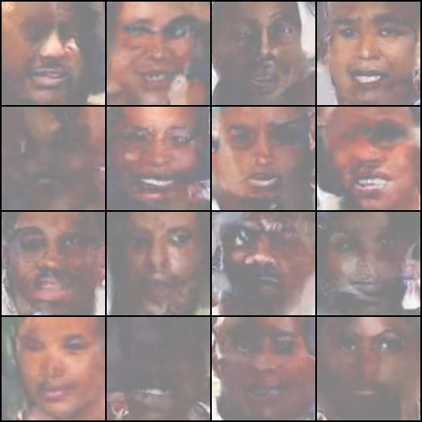

# DiffFace
DiffFace is a project that implements a diffusion model for generating synthetic face images of dark-skinned individuals, for the purpose of improving the diversity of datasets used in facial recognition systems. The project aims to address the underrepresentation of dark-skinned faces in existing datasets, which can lead to biased and inaccurate results in facial recognition applications.

## Installation
To install the required dependencies, run the following command:
```bash
pip install -r requirements.txt
```

## Usage
To train the model, use the following command:
```bash
python src/train.py
```

To sample images from the trained model, use the following command:
```bash
python src/sample.py
```

## Checkpoints
The checkpoints for the trained model can be downloaded using the following command:
```bash
bash checkpoints/checkpoints.sh
```

## Configuration
The configuration for the model can be found in the `config.py` file. You can modify the parameters in this file to customize the training and sampling process.

## Results
An example of the results generated by the model is shown below:

